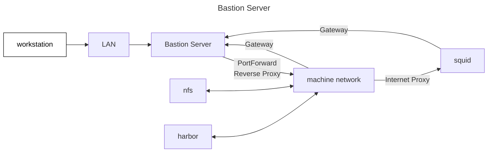

# Bastion Server

The bastion server is a server configured on the network to have visibility from both inside and outside of the machine network, and serves as the only route into or out of the cluster. A linux server (virtual or physical) with two network interfaces achieves this, together with the required software installations and configuration. The configuration described can serve as a bastion server for multiple clusters. In a scaled up architecture, redundant distributed operator tooling and network ingress/egress functions should be used.

The following software installations may be required to run day 0 operations from the command line or from a remote pipeline:

- kubectl
- talosctl
- terraform
- flux

The following server software needs to be installed on the bastion server:

- apache: For serving occasional artefacts to the clusters, and for ingress/gateway reverse-proxy and load balancing

Ingress:

- apache listens on all networks on port 80 and 443
- hostname based reverse proxy rules route appropriate traffic to the cluster's or clusters' http/s listeners
- to separate the control network from direct Internet ingress and egress, control network traffic is managed with iptables port forwarding

Egress:

- NAT: The bastion server is set up as gateway for the cluster networks, with iptables NAT configured for direct egress
- Internet proxy: Caching of artefacts from the Internet provides efficiencies and robustness. The cluster infrastructure and southern caches are configured to leverage this, adding a security visibility point.

Supporting infrastructure:

- nfs
- harbor
- squid

The following activities are required to build a cluster and bootstrap to a gitops repo:

- Git pull
- Configuration Management
- Cluster virtual machine build
- Cluster node build
- Cluster bootstrap
- Configuration retrieval
- GitOps bootstrap
- Cluster Infrastructure Deployment
- Workload deployment
