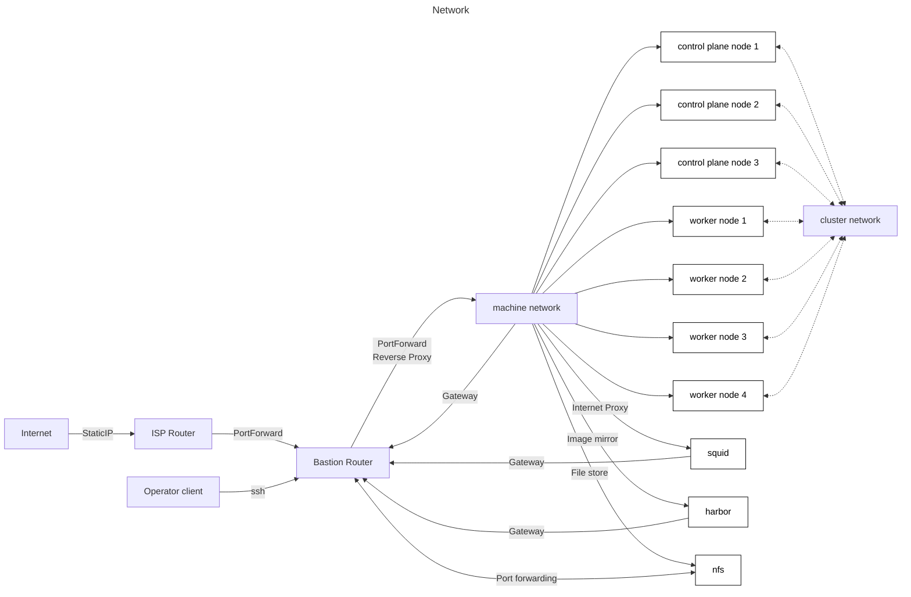

## Network

```mermaid
---
title: Network
---
flowchart LR

n0[Internet] -- StaticIP --> n1[ISP Router] -- PortForward --> n2[Bastion Router]
n2 -- PortForward<br>Reverse Proxy --> n3[machine network]
n5[Operator client] -- ssh --> n2

n3 --> sc1[control plane node 1]
n3 --> sc2[control plane node 2]
n3 --> sc3[control plane node 3]
n3 --> w1[worker node 1]
n3 --> w2[worker node 2]
n3 --> w3[worker node 3]
n3 --> w4[worker node 4]

n3 --Internet Proxy--> squid -- Gateway --> n2
n3 -- Image mirror --> harbor -- Gateway --> n2
n3 -- Gateway --> n2
n3 -- File store --> nfs <-- Port forwarding --> n2 

n4[cluster network]

sc1 <-.-> n4
sc2 <-.-> n4
sc3 <-.-> n4
w1 <-.-> n4
w2 <-.-> n4
w3 <-.-> n4
w4 <-.-> n4

classDef box fill:#fff,stroke:#000,stroke-width:1px,color:#000;
classDef spacewhite fill:#ffffff,stroke:#fff,stroke-width:0px,color:#000
class sc1,sc2,sc3,w1,w2,w3,w4,squid,harbor,nfs box
```
