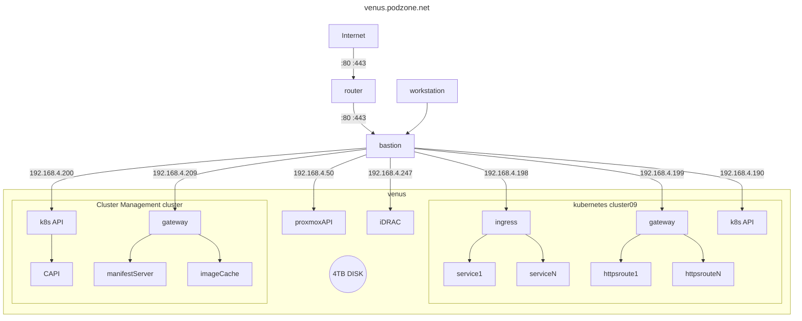

# Proxmox Hypervisor running on a PowerEdge R730

## Network Architecture

- The R730 runs on an isolated network, with the bastion server, having two network interfaces, forming a glasshouse function.
- Web traffic from the internet to any supported domains are port forwarded to the bastion server
- The bastion server provides internet gateway services to the isolated network.
- Various services in the isolated network are made available via the bastion server for local access.

## Provisioning

- <https://github.com/christensenjairus/ClusterCreator>
- <https://cyber-engine.com/blog/2024/06/25/k8s-on-proxmox-using-clustercreator/>
- <https://github.com/DushanthaS/kubernetes-the-hard-way-on-proxmox>
- <https://github.com/siderolabs/image-factory>
- <https://blog.stonegarden.dev/articles/2024/08/talos-proxmox-tofu/>
- <https://github.com/rgl/terraform-proxmox-talos>
- <https://olav.ninja/talos-cluster-on-proxmox-with-terraform>
- <https://github.com/kubernetes-sigs/kubespray>
- <https://kubespray.io/>
- <https://blog.andreasm.io/2024/01/15/proxmox-with-opentofu-kubespray-and-kubernetes/>
- <https://medium.com/@abhigyan.dwivedi_58961/creating-a-kvm-kubernetes-cluster-with-vagrant-kubespray-and-ansible-a-idiot-resistant-guide-2f3727ce7039>

## Monitoring

- <https://github.com/prometheus-community/helm-charts/tree/main/charts/kube-prometheus-stack>
- <https://github.com/prometheus-operator/kube-prometheus>
- Network Monitoring: <https://docs.cilium.io/en/stable/overview/intro/>
- Kubernetes Document Generation: <https://github.com/philippemerle/KubeDiagrams>
- Document Generation: <https://www.graphviz.org/>

### Monitoring hardware

- IPMI Tool suite: <https://www.gnu.org/software/freeipmi/>
- Dell idrac exporter: <https://github.com/galexrt/dellhw_exporter>
- Dell Redfish idrac exporter: <https://github.com/mrlhansen/idrac_exporter>
- Redfish idrac exporter: <https://github.com/jenningsloy318/redfish_exporter>
- Prometheus ipmi exporter: <https://github.com/prometheus-community/ipmi_exporter>
- SNMP Exporter: <https://github.com/prometheus/snmp_exporter>
- Helm chart for SNMP Exporter: <https://github.com/prometheus-community/helm-charts/tree/main/charts/prometheus-snmp-exporter>
- Node-Exporter ipmitool collector: <https://github.com/prometheus-community/node-exporter-textfile-collector-scripts/blob/master/ipmitool>
- Grafana Dashboard for idrac: <https://grafana.com/grafana/dashboards/13177-ipmi-for-prometheus/>

## Networking

- Creating template files: <https://github.com/trfore/proxmox-template-scripts?tab=readme-ov-file>
- For Bastion: IP Tables Load Balancer: <https://github.com/muzahid-c/iptables-loadbalancer>

## Cloud init

- <https://austinsnerdythings.com/2021/08/30/how-to-create-a-proxmox-ubuntu-cloud-init-image/>

## Storage

- <https://github.com/LINBIT/linstor-server>
- <https://linbit.com/drbd/>
- <https://github.com/piraeusdatastore/piraeus-operator>
- <https://syncthing.net/>
- <https://github.com/sergelogvinov/proxmox-csi-plugin>
